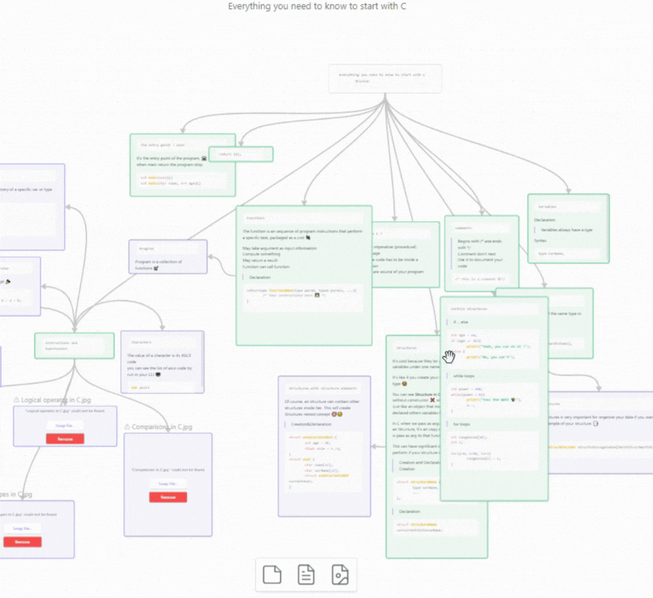

# Node Screenshot

A plugin for [Obsidian](https://obsidian.md) that lets you capture any node of a Canvas as a PNG image.



## Features

- Capture a single Canvas node as a PNG image, straight from its context menu.
- The background of the image matches your theme (light or dark).
- No settings to configure: install it and it works.

## Usage

1. Open a Canvas.
2. Right-click the node you want to capture.
3. Select **Capture node screenshot** in the menu.
4. Choose where to save the image. By default it is named after the capture date and time, for example `canvas-node-screenshot-2026-09-19-143210.png`.

## Installation

### From Obsidian (recommended)

1. Open **Settings → Community plugins**.
2. If needed, turn off **Restricted mode**.
3. Click **Browse** and search for **Node Screenshot**.
4. Click **Install**, then **Enable**.

### Manual installation

1. Go to the [Releases](https://github.com/cestfredy/obsidian-canvas-node-screenshot/releases) page and download `main.js` and `manifest.json` from the latest release.
2. In your vault, create the folder `.obsidian/plugins/canvas-node-screenshot/` and copy both files into it.
3. Restart Obsidian (or reload the plugin list), then enable **Node Screenshot** in **Settings → Community plugins**.

## Development

```bash
npm install
npm run dev # rebuilds main.js on every change
npm run build # type-checks and builds for production
```

To release a new version, run `npm version patch` (or `minor` / `major`), then `git push --follow-tags`. The [release workflow](./.github/workflows/release.yml) builds the plugin and creates a draft GitHub release. See [CONTRIBUTING.md](./CONTRIBUTING.md) for more.

## Support

- Found a bug or have an idea? [Open an issue](https://github.com/cestfredy/obsidian-canvas-node-screenshot/issues).
- If you find this plugin helpful, you can **Star ⭐** this repository.

## License

[MIT](./LICENSE)
